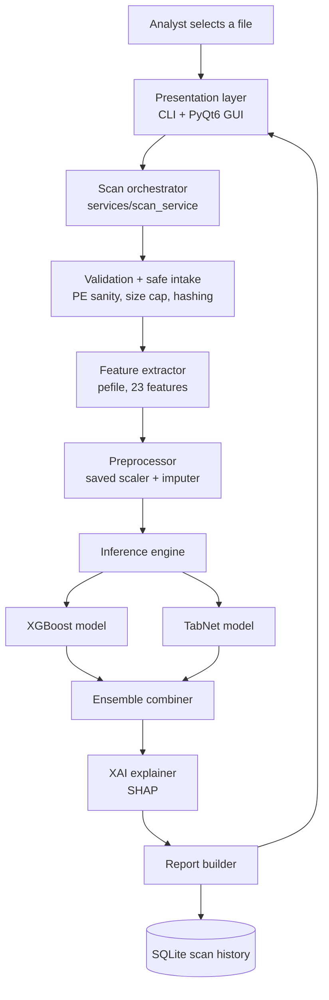
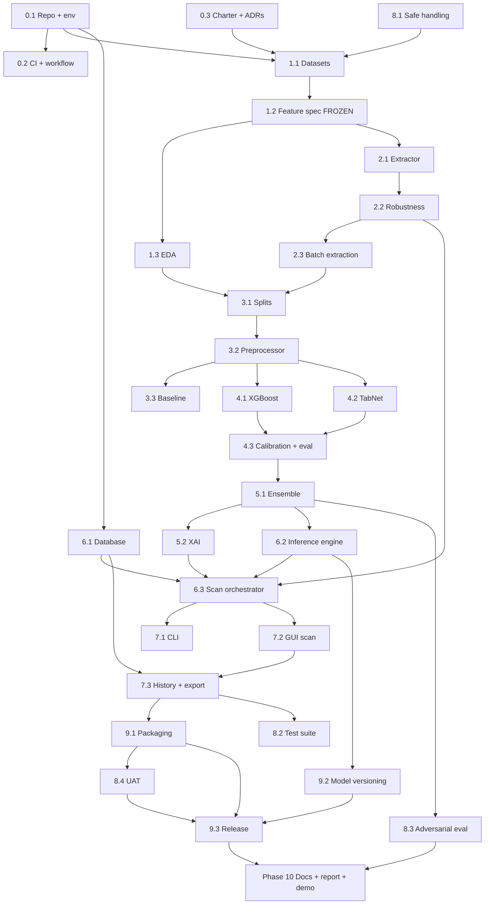

# VOXA — Development Roadmap

*Ransomware Malware Detection Using AI · University of Lahore FYP · Saad Maqbool & M. Taimoor Azam · Supervisor: Ms. Namra Tahir*

2026-09-18 · @Someone

## 1. Project understanding

VOXA is a lightweight, offline, standalone AI tool that classifies Windows PE files (`.exe`, `.dll`) as ransomware or benign **before execution**, using 23 statically-extracted PE features, an XGBoost + TabNet ensemble, and feature-level explanation.

### Problem being solved

Signature-, behaviour- and network-based detection generally acts after a sample begins executing, by which point ransomware may already be encrypting files. Existing tools are broad platforms rather than lightweight utilities, do not focus specifically on pre-execution ransomware detection, and expose little about why a file was flagged. VOXA targets that gap: pre-execution, PE-structure-only, ransomware-focused, explainable, offline.

### Target users

Cybersecurity analysts, incident responders, IT administrators, software developers and QA engineers, cybersecurity students.

### Core objectives (documented)

1. Analyze PE files without executing them.
2. Extract 23 PE features.
3. Ensemble XGBoost and TabNet for ransomware classification.
4. Provide feature-level threat explanation.
5. Develop a lightweight standalone tool.
6. Store previous scan results for future review.

### Documented functional requirements

| ID | Requirement | Source |
| --- | --- | --- |
| FR-1 | File scanner: user selects an `.exe` or `.dll` for analysis | Functionality 1 |
| FR-2 | Pre-execution detection: the file is never run | Functionality 2 |
| FR-3 | Output label Ransomware/Benign with a confidence score | Functionality 3 |
| FR-4 | Hybrid detection combining XGBoost and TabNet predictions | Functionality 4, §7 |
| FR-5 | Automatic extraction of the 23 PE structural features | Functionality 5 |
| FR-6 | XAI: show features driving the decision (entropy, suspicious API imports) | Functionality 6 |
| FR-7 | Full detection pipeline runs offline, no cloud, no VirusTotal | Functionality 7, §15 |
| FR-8 | Scan report: file info, result, confidence, per-model predictions, important features, suspicious characteristics | Functionality 8 |
| FR-9 | Scan history stored and reviewable | Functionality 9 |

### Documented non-functional requirements

- Lightweight standalone desktop/CLI tool, not a security platform.
- Offline-first: core detection depends on no network service.
- Safe: analysis is purely static, no sample is executed.
- Explainable: every prediction carries feature attributions.
- Packaged for distribution with PyInstaller.

### Documented evaluation criteria

Accuracy, precision, recall, F1-score, ROC-AUC, false-positive rate, false-negative rate, detection time, reported separately for XGBoost, TabNet and the ensemble so the hybrid approach can be justified.

### Documented technologies

Python, Next.js, HTML, "E Analysis", `pefile`; XGBoost, scikit-learn; TabNet, PyTorch; Tkinter / PyQt / CLI; PyInstaller. Datasets named: BODMAS and EMBER.

### Ambiguities, with recommended assumptions

These are flagged rather than silently resolved. Confirm each with the supervisor in week 1.

**A-1 — the 23 PE features are never enumerated.** The whole project hangs on this list.

> **Recommended Assumption:** lock a written Feature Specification v1.0 in Phase 1 before any modelling. Suggested composition, all statically derivable with `pefile`: header fields (Machine, NumberOfSections, TimeDateStamp, PointerToSymbolTable, SizeOfOptionalHeader, Characteristics), optional-header fields (MajorLinkerVersion, SizeOfCode, SizeOfInitializedData, SizeOfUninitializedData, AddressOfEntryPoint, BaseOfCode, ImageBase, SectionAlignment, FileAlignment, SizeOfImage, SizeOfHeaders, CheckSum, Subsystem, DllCharacteristics), plus derived features (mean and max section entropy, imported DLL count, imported function count, exported function count, crypto/filesystem API import count, resource count, signature-present flag). Trim to exactly 23 and record the final list in `docs/feature_spec.md`.

**A-2 — Next.js and HTML are listed, but the tool is described as an offline standalone desktop/CLI tool.** These conflict.

> **Recommended Assumption:** build CLI + PyQt6 desktop GUI as the primary graded deliverable. Treat Next.js as an optional Phase 10 stretch: a localhost-only dashboard over a FastAPI loopback API, used for demo visualisation. It must never become a dependency of the core detection path.

**A-3 — "E Analysis" is almost certainly a typo for "PE Analysis".** Treated as such.

**A-4 — binary vs multi-class is inconsistent.** The document says ransomware/benign but also mentions unseen ransomware families.

> **Recommended Assumption:** the deployed model is binary. BODMAS family labels are kept as metadata only, for family-stratified generalisation testing and error analysis, not as training targets.

**A-5 — the "assemble mechanism" is unspecified.**

> **Recommended Assumption:** weighted soft voting over calibrated probabilities as the default, with a logistic-regression stacking meta-learner on out-of-fold probabilities as the comparison variant. Choose on validation ROC-AUC and false-negative rate; report both.

**A-6 — dataset shape does not match the tool's runtime output.** EMBER ships pre-computed high-dimensional feature vectors, not raw binaries; BODMAS ships pre-extracted features plus family labels.

> **Recommended Assumption:** treat this as the project's largest technical risk. Phase 1 includes a feature-parity audit: for each of the 23 features, confirm it can be reconstructed from the public dataset and produced by your own extractor with identical semantics and units. Where a feature cannot be matched, drop it or source it from a locally-collected benign corpus plus a controlled, supervisor-approved malicious corpus.

**A-7 — no database technology is named,** only "store previous scan results".

> **Recommended Assumption:** SQLite via SQLAlchemy. File-based, zero-config, offline, ships inside the PyInstaller bundle.

**A-8 — out of scope.** The document contains no RAG requirement, no AI-agent or agentic-workflow requirement, and no MCP requirement. This roadmap does not invent them; §2 explains why they are inapplicable to a static tabular classifier, so the omission is defensible in the viva.

## 2. System architecture

VOXA is a single-process, layered desktop application. Nothing crosses a network boundary in the detection path.

### Layer responsibilities

| Layer | Module | Responsibility |
| --- | --- | --- |
| Presentation | `voxa/ui/cli.py`, `voxa/ui/gui/` | File selection, progress, result rendering, history browsing. Holds no detection logic. |
| Orchestration | `voxa/services/scan_service.py` | Single public entry point `scan(path) -> ScanResult`. Sequences validation, extraction, inference, explanation, persistence. |
| Safe intake | `voxa/core/validator.py` | Confirms a readable PE, enforces a size cap, computes SHA-256, refuses anything malformed. The file is opened read-only and never executed. |
| Feature extraction | `voxa/core/features/` | Produces exactly the 23 features in the frozen order defined by `feature_spec.md`. The one module shared by training and inference. |
| Preprocessing | `voxa/core/preprocess.py` | Applies the imputer and scaler fitted during training and serialized alongside the models. |
| Inference | `voxa/core/inference/` | Loads the versioned XGBoost and TabNet artifacts, returns calibrated probabilities from each. |
| Ensemble | `voxa/core/ensemble.py` | Combines the two probabilities into a final score and label against a tuned threshold. |
| Explanation | `voxa/core/explain.py` | SHAP values for the XGBoost path plus TabNet attention masks; emits the top contributing features with direction and human-readable text. |
| Persistence | `voxa/db/` | SQLAlchemy models and repository over SQLite. Stores scan metadata, result, per-model scores, feature vector and top attributions. |

### The training pipeline is a separate tree

`training/` holds dataset preparation, model training, evaluation and artifact export. It imports `voxa/core/features/` so that the exact code producing training rows also produces inference rows. This single shared module is what prevents training-serving skew, and it is the most important architectural decision in the project.

### Why there is no RAG, agent or MCP layer

The proposal specifies none of these, and each would be a poor fit here. RAG retrieves text to ground a language model; VOXA's input is a fixed-width numeric vector from a binary file, with no corpus to retrieve from and no generated prose to ground. Agentic planning implies multi-step tool selection under uncertainty; VOXA's pipeline is a fixed nine-step sequence where non-determinism would reduce reproducibility and make the evaluation chapter weaker. MCP exposes tools to external LLM clients over a transport; the requirement is an offline standalone binary with no external client. Adding them would contradict the stated offline and lightweight constraints.

> **Recommended Assumption (optional, only if a supervisor requires an LLM component):** the cleanest justified addition would be a natural-language report writer that converts the SHAP output into an analyst-readable paragraph, run through a small local model via Ollama, behind an off-by-default flag so the core path stays offline and deterministic. Treat this as Phase 10 stretch work, not core scope.

## 3. Technology stack

Everything named in the proposal is kept. Additions are marked and justified; nothing is swapped out for novelty.

| Component | Technology | Purpose | Reason |
| --- | --- | --- | --- |
| Language | Python 3.11 | Whole system | Named in the document; 3.11 is the highest version with settled wheels for PyTorch, XGBoost and PyInstaller |
| PE parsing | `pefile` | Read headers, sections, imports, exports, resources without execution | Named in the document; pure-Python, no execution risk |
| Entropy / hashing | `hashlib`, stdlib `math` | Section entropy, SHA-256 identity | No dependency needed |
| Classical model | XGBoost | Primary tabular classifier | Named in the document |
| Preprocessing, metrics, baseline | scikit-learn | Imputer, scaler, splits, baseline logistic regression, all metric computation, probability calibration | Named in the document |
| Deep model | `pytorch-tabnet` on PyTorch | Attention-based tabular classifier and built-in feature masks | Named in the document; the maintained TabNet implementation |
| Explainability | SHAP | Per-prediction feature attribution for FR-6 | **Recommended Assumption** — the document requires XAI but names no library; SHAP gives exact TreeSHAP for XGBoost and is the defensible choice in a report |
| Data handling | pandas, NumPy | Dataset assembly, feature frames | **Recommended Assumption** — implied by any tabular ML work |
| Experiment tracking | MLflow (local file backend) | Log runs, params, metrics, artifacts; compare XGBoost vs TabNet vs ensemble | **Recommended Assumption** — makes the evaluation chapter reproducible; runs fully offline against a local directory |
| Database | SQLite + SQLAlchemy 2.x | Scan history (FR-9) | **Recommended Assumption** (A-7) — file-based, offline, bundles cleanly |
| Schema validation | Pydantic v2 | `ScanResult`, `FeatureVector`, config objects | **Recommended Assumption** — a typed contract between layers catches feature-order bugs early |
| Desktop UI | PyQt6 | Primary GUI | Document allows Tkinter/PyQt/CLI; PyQt6 gives a usable table view for scan history and a presentable demo |
| CLI | Typer | Scriptable interface, batch scanning | **Recommended Assumption** — the document names CLI without a library; Typer generates help and validation from type hints |
| Packaging | PyInstaller | Single-folder Windows distributable | Named in the document |
| Testing | pytest, pytest-cov | Unit, integration, regression | **Recommended Assumption** — standard practice |
| Quality gates | ruff, black, mypy | Lint, format, type-check | **Recommended Assumption** — cheap to add, visible evidence of engineering practice |
| CI | GitHub Actions | Run tests and lint on every push | **Recommended Assumption** — CI runs on code only, never on samples |
| Version control | Git + GitHub (private) | Source, issues, releases | **Recommended Assumption** — private because the repo touches malware research |
| Optional dashboard | Next.js + FastAPI on loopback | Phase 10 stretch only, scan-history visualisation | Reconciles the Next.js mention (A-2) without touching the offline core |

### Deliberately excluded

No cloud services, no VirusTotal or any online reputation API, no sandbox or dynamic execution component, no vector database, no LLM in the core path. Each of these would violate FR-2 (never execute) or FR-7 (fully offline).

## 4. Development roadmap — Phases 0 to 2

Eleven phases run from empty repository to final demo. Phases 0 to 2 build the ground everything else stands on: the repo, the locked feature contract, and the extractor that produces those features.

---

### Phase 0 — Foundation and environment

**Objective:** a reproducible repository, environment and quality gate that both developers share, so no later work is lost to "works on my machine".

**Why required:** the project has two developers, two model families with heavy and conflicting dependencies (PyTorch, XGBoost), and a packaging target. Getting dependency pinning and structure wrong in week 1 costs weeks later.

**Prerequisites:** none.

**Milestones:** 0.1 repository and environment reproducible on both machines · 0.2 CI green on an empty test suite · 0.3 project charter and feature-spec stub agreed with supervisor.

#### Chunk 0.1 — Repository skeleton and environment

**Objective:** one command takes a clean machine to a working dev environment.

**Tasks:**

1. Create a private GitHub repository `voxa`, add both developers and the supervisor as collaborators.
2. Create the package layout below and make every package importable.
3. Pin dependencies. Use one environment, not two: resolve PyTorch (CPU build) and XGBoost together once and freeze.
4. Add `.gitignore` covering `*.exe`, `*.dll`, `data/raw/`, `models/`, `*.db`, `.env`, `mlruns/` — no binary sample and no model artifact ever enters Git.
5. Write `README.md` with setup steps, and `Makefile` targets `setup`, `test`, `lint`, `train`, `scan`.

**Subtasks:**

- Directory tree: `voxa/{core,services,db,ui,utils}`, `training/{data,models,evaluation}`, `tests/{unit,integration,fixtures}`, `docs/`, `scripts/`, `models/`, `data/{raw,interim,processed}`.
- `pyproject.toml` with project metadata, dependencies, ruff/black/mypy config.
- `requirements.lock` generated from the resolved environment; both developers install from the lock, never from loose versions.
- `voxa/config.py` reading paths and thresholds from `.env` via Pydantic settings, with `.env.example` committed.
- `voxa/utils/logging.py`: structured logging to `logs/voxa.log`, rotating, level from config.

**Files/components:** whole tree, `pyproject.toml`, `requirements.lock`, `Makefile`, `README.md`, `.gitignore`, `voxa/config.py`, `voxa/utils/logging.py`.

**Technologies:** Python 3.11, venv, pip-tools or uv, Pydantic settings.

**Dependencies:** none. **This blocks every other chunk in the project.**

**Expected output:** a cloneable repo where `make setup && make test` succeeds on both developers' machines.

**Validation:** the developer who did *not* write the setup clones fresh into a new directory and runs `make setup` to green, from the README alone, with no verbal help.

**Definition of Done:** clean-clone setup verified independently by both developers; `import voxa` and `import training` both succeed; logging writes to file.

#### Chunk 0.2 — Git workflow, CI and quality gates

**Objective:** every push is linted, type-checked and tested automatically.

**Tasks:**

1. Adopt trunk-based development: `main` protected, short-lived `feat/*` and `fix/*` branches, PR required, one reviewer (the other developer).
2. Add `.github/workflows/ci.yml` running ruff, black `--check`, mypy and pytest on push and PR.
3. Add pre-commit hooks mirroring the CI checks so failures surface locally first.
4. Add PR and issue templates; create a GitHub Project board with one column per phase.
5. Write one trivial passing test so CI has something real to run.

**Files/components:** `.github/workflows/ci.yml`, `.pre-commit-config.yaml`, `.github/ISSUE_TEMPLATE/`, `tests/unit/test_smoke.py`.

**Technologies:** GitHub Actions, pre-commit, ruff, black, mypy, pytest.

**Dependencies:** BLOCKING on 0.1.

**Expected output:** a green CI badge and an enforced review workflow.

**Validation:** open a deliberately broken PR (unused import, type error) and confirm CI blocks the merge.

**Definition of Done:** protected `main`; CI green; both developers have merged at least one reviewed PR.

#### Chunk 0.3 — Project charter and scope agreement

**Objective:** close the ambiguities in §1 in writing before code depends on them.

**Tasks:**

1. Write `docs/charter.md`: scope, non-goals, the A-1 to A-8 decisions, and the definition of success (target metrics with numbers).
2. Hold a supervisor review covering: binary vs family classification (A-4), the Next.js question (A-2), and dataset access and ethical handling (A-6).
3. Obtain written supervisor and department approval for handling malicious samples, including where they may be stored and on which machine.
4. Record decisions as dated ADRs in `docs/adr/`.

**Files/components:** `docs/charter.md`, `docs/adr/0001-binary-classification.md`, `docs/adr/0002-ui-strategy.md`, `docs/adr/0003-sample-handling.md`.

**Dependencies:** none technically; PARALLEL with 0.1 and 0.2.

**Expected output:** an approved charter with no open A-items.

**Validation:** supervisor sign-off recorded in the doc.

**Definition of Done:** every ambiguity from §1 has a written, dated decision.

---

### Phase 1 — Dataset and the feature contract

**Objective:** an approved dataset on disk and a frozen, written specification of the 23 features that both training and inference will use forever.

**Why required:** A-1 and A-6 are the two risks most likely to sink this project. Everything downstream — extractor, models, XAI, UI labels — is keyed to the feature list. Changing it in Phase 5 invalidates every trained model.

**Prerequisites:** Phase 0 complete; supervisor approval for sample handling.

**Milestones:** 1.1 datasets acquired and inventoried · 1.2 Feature Specification v1.0 frozen · 1.3 feature-parity audit passed · 1.4 EDA report written.

#### Chunk 1.1 — Dataset acquisition and inventory

**Objective:** obtain BODMAS and EMBER legitimately and know exactly what is in them.

**Tasks:**

1. Request and download BODMAS (feature vectors plus family labels) and EMBER through their official channels; record licences and citations in `docs/datasets.md`.
2. Verify checksums; store under `data/raw/` on the designated research machine, never in Git.
3. Inventory each dataset: sample counts, class balance, time span of samples, feature schema, label semantics.
4. Using BODMAS family labels, derive the ransomware subset: build an explicit allow-list of ransomware family names and document the mapping rule. Everything else malicious is excluded or held out — do not silently treat all malware as ransomware.
5. Quantify the resulting ransomware vs benign counts and the imbalance ratio.

**Subtasks:**

- `docs/datasets.md`: provenance, licence, citation, retrieval date, checksum per file.
- `training/data/inventory.py` producing a summary JSON and a class-balance table.
- `docs/family_mapping.md`: the exact family-name to ransomware-label rule, reviewed by the supervisor.

**Files/components:** `training/data/inventory.py`, `docs/datasets.md`, `docs/family_mapping.md`.

**Dependencies:** BLOCKING on 0.1 and 0.3 (sample-handling approval).

**Expected output:** raw datasets on disk, inventory report, a documented ransomware label definition.

**Validation:** counts reproduce on re-run; supervisor agrees with the family mapping.

**Definition of Done:** ransomware and benign row counts are known, documented and reproducible.

#### Chunk 1.2 — Feature Specification v1.0 and parity audit

**Objective:** freeze the 23 features and prove each one can be produced identically from the dataset and from a real file.

**Tasks:**

1. Draft the 23-feature list (start from the A-1 candidate list), each with: name, `pefile` source path, dtype, unit, valid range, missing-value policy, and index position.
2. For each feature, determine whether it exists in the dataset schema, can be derived from it, or must be extracted from raw files. Record the verdict per feature.
3. Run the parity test: take 20 real benign Windows binaries, extract features with your own extractor, and compare against the dataset's values for the same or equivalent fields. Any semantic mismatch (different units, different entropy base, different counting rule) must be resolved now.
4. Resolve every mismatch by either aligning your extractor to the dataset definition or dropping and replacing the feature.
5. Freeze the list as `feature_spec.md` v1.0 with an explicit ordered index, and encode it as a single source-of-truth constant in code.
6. Record the escalation path: if fewer than 23 features survive parity, the fallback is stated in Phase 1's risk row (§9).

**Subtasks:**

- `voxa/core/features/spec.py` holding `FEATURE_NAMES: tuple[str, ...]` of length 23 and per-feature metadata; a unit test asserts the length is exactly 23 and the order never changes.
- `docs/feature_spec.md` human-readable table, one row per feature, including why each is plausibly discriminative for ransomware.
- `training/data/parity_audit.py` producing a per-feature match/mismatch report.

**Files/components:** `voxa/core/features/spec.py`, `docs/feature_spec.md`, `training/data/parity_audit.py`, `tests/unit/test_feature_spec.py`.

**Dependencies:** BLOCKING on 1.1. **This chunk blocks Phases 2, 3, 4 and 5.**

**Expected output:** a frozen, ordered, documented 23-feature contract with an audit report behind it.

**Validation:** the audit report shows an acceptable verdict for all 23; the order test passes.

**Definition of Done:** `feature_spec.md` v1.0 signed off; no open mismatches; the code constant and the document agree.

#### Chunk 1.3 — Exploratory data analysis

**Objective:** understand the data well enough to choose preprocessing and anticipate error modes.

**Tasks:**

1. Build the analysis dataframe of the 23 features plus label plus family metadata.
2. Per feature: distribution, missing rate, zero/constant rate, outlier share, class-conditional distribution.
3. Compute feature-label association (mutual information, point-biserial correlation) and a feature-feature correlation matrix to spot redundancy.
4. Check for leakage-prone features — particularly `TimeDateStamp`, which can encode collection-time rather than maliciousness. Document the decision to keep, transform or drop it.
5. Examine family distribution within the ransomware class to see whether one family dominates.
6. Write `docs/eda_report.md` with the findings that will drive preprocessing choices.

**Files/components:** `notebooks/01_eda.ipynb`, `docs/eda_report.md`, `training/data/eda.py`.

**Dependencies:** BLOCKING on 1.2. PARALLEL with Chunk 2.1.

**Expected output:** an EDA report naming concrete preprocessing decisions (which features to log-transform, clip, or drop).

**Validation:** the notebook runs end to end from `data/raw/`; every claim in the report traces to a cell.

**Definition of Done:** report merged; leakage question answered in writing.

---

### Phase 2 — Static PE feature extraction engine

**Objective:** a hardened module that turns any `.exe` or `.dll` on disk into the 23-value vector, without executing it, and never crashes the application.

**Why required:** this is FR-5 and the component the entire runtime depends on. It is also the single shared module between training and inference, so it must be correct before models are trained on its output.

**Prerequisites:** Chunk 1.2 frozen.

**Milestones:** 2.1 extractor produces the 23-vector · 2.2 hardened against malformed and adversarial files · 2.3 batch extraction over a corpus.

#### Chunk 2.1 — Core extractor

**Objective:** `extract_features(path) -> FeatureVector` implementing `feature_spec.md` exactly.

**Tasks:**

1. Implement `PEParser` wrapping `pefile`: open the file read-only in binary mode, parse headers, sections, imports, exports, resources. Never invoke, load or map the file as executable code.
2. Implement one extractor function per feature group: header fields, optional-header fields, section statistics, import/export statistics, resource statistics.
3. Implement Shannon entropy over section bytes with the base and normalisation fixed by the spec, and unit-test it against hand-computed values.
4. Implement the crypto/filesystem API import counter from a curated, documented keyword list stored in `voxa/core/features/api_groups.py`.
5. Assemble into an ordered NumPy array using `FEATURE_NAMES`, returning a Pydantic `FeatureVector` that carries both the array and a name-to-value mapping for the UI.
6. Define missing-value semantics: a field absent from the PE yields the spec's sentinel, never a silent zero that collides with a real zero.

**Subtasks:**

- `voxa/core/features/parser.py`, `extractors.py`, `entropy.py`, `api_groups.py`, `__init__.py` exposing `extract_features`.
- `voxa/core/models/feature_vector.py` Pydantic schema with length and order validation.
- Unit tests per extractor against three committed tiny fixture PEs (benign, self-compiled, safe to store in the repo).

**Files/components:** `voxa/core/features/*`, `tests/unit/test_extractors.py`, `tests/fixtures/pe/`.

**Technologies:** `pefile`, NumPy, Pydantic.

**Dependencies:** BLOCKING on 1.2. PARALLEL with 1.3 and with Chunk 6.1 (DB schema).

**Expected output:** a deterministic 23-length vector for any valid PE.

**Validation:** extract from a known benign binary (e.g. a system `.dll` copy) and verify a hand-checked subset of fields against a PE viewer; entropy unit tests pass against precomputed values; running twice on the same file gives byte-identical output.

**Definition of Done:** all 23 features implemented; per-feature unit tests pass; output order matches `FEATURE_NAMES`; no code path executes the analyzed file.

#### Chunk 2.2 — Robustness and safe intake

**Objective:** malformed, truncated, packed or deliberately malformed PEs produce a clean error, never a crash or a hang.

**Tasks:**

1. Implement `voxa/core/validator.py`: existence, readability, size cap (recommended 100 MB), magic-byte check for `MZ`, PE signature check, and a decision on whether `.dll` and `.exe` are both accepted.
2. Wrap all `pefile` access in a typed exception hierarchy: `NotAPEFile`, `CorruptPEFile`, `UnsupportedPEFile`, `ExtractionTimeout`.
3. Add a hard timeout and a resource guard around parsing so a crafted file cannot hang the UI or exhaust memory.
4. Build a hostile fixture set: zero-byte file, text file renamed `.exe`, truncated PE, PE with zero sections, PE with an enormous declared section count, PE with no imports, 64-bit and 32-bit variants, .NET assembly.
5. Ensure every failure path logs with the file hash and returns a structured error the UI can render, without leaking a stack trace to the user.

**Files/components:** `voxa/core/validator.py`, `voxa/core/exceptions.py`, `tests/unit/test_validator.py`, `tests/fixtures/malformed/`.

**Dependencies:** BLOCKING on 2.1.

**Expected output:** an extractor that fails safely and informatively on everything in the hostile set.

**Validation:** the hostile fixture suite runs with zero uncaught exceptions and zero hangs; parsing a 100 MB file stays within the timeout.

**Definition of Done:** hostile suite green; every exception type has a user-facing message; coverage of `features/` and `validator.py` above 85%.

#### Chunk 2.3 — Batch extraction pipeline

**Objective:** turn a directory of files into a labelled feature table for training.

**Tasks:**

1. Implement `training/data/build_dataset.py`: walk a labelled directory tree or a dataset manifest, extract in parallel with a process pool, write to Parquet.
2. Record per-row provenance: SHA-256, source dataset, family label, extraction timestamp, extractor version.
3. Handle failures by skipping and recording, never aborting the run; emit a failure report with counts by exception type.
4. Add a resumable checkpoint so a long run can restart without redoing completed files.
5. Stamp the output with `feature_spec` version so a dataset built with an older spec can never be mixed with a newer one.

**Files/components:** `training/data/build_dataset.py`, `data/processed/features_v1.parquet`, `docs/extraction_report.md`.

**Technologies:** multiprocessing, pandas, PyArrow.

**Dependencies:** BLOCKING on 2.2 and 1.1.

**Expected output:** a versioned Parquet feature table with provenance columns, plus a failure report.

**Validation:** row count plus failure count equals input count; a re-run from checkpoint produces an identical table; spot-check 10 rows against direct single-file extraction.

**Definition of Done:** the training table exists, is reproducible, and carries its spec version.

## 5. Development roadmap — Phases 3 to 5

This is the ML core: split strategy, baseline, both models, the ensemble that makes the project "hybrid", and the explanation layer that satisfies FR-6.

---

### Phase 3 — Data preparation and baseline

**Objective:** a leak-free split strategy, a fitted preprocessing pipeline, and a baseline whose scores every later model must beat.

**Why required:** without a baseline, "XGBoost got 97%" means nothing — a trivial model on imbalanced malware data can look strong. The baseline is what makes the evaluation chapter defensible.

**Prerequisites:** Chunk 2.3 (feature table exists), Chunk 1.3 (EDA decisions).

**Milestones:** 3.1 splits frozen and saved · 3.2 preprocessing pipeline fitted and serialized · 3.3 baseline results recorded.

#### Chunk 3.1 — Split strategy

**Objective:** train/validation/test splits that do not flatter the model.

**Tasks:**

1. Implement stratified 70/15/15 train/validation/test on the binary label, with a fixed seed recorded in config.
2. Deduplicate by SHA-256 across the whole dataset *before* splitting — identical binaries appearing in both train and test is the most common source of inflated malware-detection scores.
3. Implement **family-disjoint splitting** as a second, harder evaluation: hold out entire ransomware families from training so the test set measures generalisation to unseen families, as the proposal requires.
4. If timestamps are reliable, add a **temporal split** (train on older, test on newer) as a third scenario reflecting real deployment.
5. Persist split indices to disk so every experiment uses byte-identical splits.
6. Set up 5-fold stratified cross-validation on the training portion for hyperparameter search and for generating out-of-fold probabilities the stacking ensemble will need.

**Files/components:** `training/data/splits.py`, `data/processed/splits/{random,family,temporal}.json`, `tests/unit/test_splits.py`.

**Dependencies:** BLOCKING on 2.3.

**Expected output:** three named split scenarios, saved as index files.

**Validation:** assert zero hash overlap between train and test; assert zero family overlap in the family-disjoint split; class proportions match within 1 percentage point.

**Definition of Done:** split tests pass; splits are reproducible from the seed.

#### Chunk 3.2 — Preprocessing pipeline

**Objective:** one fitted, serializable transform used identically in training and inference.

**Tasks:**

1. Build an sklearn `Pipeline`: missing-value imputation per the spec's policy, then log1p or quantile transforms for the heavy-tailed size and entropy features identified in EDA, then standard scaling.
2. Fit **on the training split only**; transform validation and test with the fitted object. Never fit on the full dataset.
3. Decide and document the class-imbalance strategy: `scale_pos_weight` for XGBoost, class weights for TabNet. Prefer weighting to resampling; if SMOTE is trialled, apply it inside cross-validation folds only, never before splitting.
4. Serialize the fitted pipeline to `models/preprocessor_v1.joblib` with the spec version embedded.
5. Write `voxa/core/preprocess.py` to load and apply that artifact at inference, sharing the same feature order constant.

**Files/components:** `training/data/preprocess.py`, `voxa/core/preprocess.py`, `models/preprocessor_v1.joblib`.

**Dependencies:** BLOCKING on 3.1.

**Expected output:** a fitted preprocessor artifact plus the inference-side loader.

**Validation:** transform the same raw vector through the training path and the inference path and assert the outputs are numerically identical — this test is the guard against training-serving skew and must stay in CI.

**Definition of Done:** parity test green; no fit ever touches validation or test data.

#### Chunk 3.3 — Baseline models

**Objective:** establish the floor.

**Tasks:**

1. Implement three baselines: majority-class, logistic regression, and a single decision tree of depth 5.
2. Evaluate all three on the random split using the full metric set from §7.
3. Log runs to MLflow with parameters, metrics and the split scenario as a tag.
4. Record the numbers in `docs/baseline_results.md` and set the minimum bar the ensemble must clear.
5. Inspect the depth-5 tree's splits as a sanity check that the features carry real signal in the expected direction.

**Files/components:** `training/models/baseline.py`, `docs/baseline_results.md`, `mlruns/`.

**Dependencies:** BLOCKING on 3.2.

**Expected output:** a baseline metrics table across all three split scenarios.

**Validation:** re-running with the same seed reproduces the metrics exactly.

**Definition of Done:** baseline table committed; target thresholds for the final system agreed with the supervisor.

---

### Phase 4 — XGBoost and TabNet

**Objective:** two trained, tuned, calibrated, versioned models, each evaluated independently.

**Why required:** these are the two models the proposal names, and the comparison between them is a required output.

**Prerequisites:** Phase 3 complete.

**Milestones:** 4.1 XGBoost trained and tuned · 4.2 TabNet trained and tuned · 4.3 both calibrated, serialized and evaluated · 4.4 error analysis written.

> Chunks 4.1 and 4.2 are **PARALLEL** — one developer per model, both against the same frozen splits and preprocessor. This is the natural place to split the two-person team.

#### Chunk 4.1 — XGBoost

**Objective:** a tuned gradient-boosted classifier.

**Tasks:**

1. Train a default-parameter XGBoost on the training split as an internal reference point.
2. Run hyperparameter search (Optuna or randomized search, 50–100 trials) over `max_depth`, `learning_rate`, `n_estimators`, `subsample`, `colsample_bytree`, `min_child_weight`, `gamma`, `reg_lambda`, using 5-fold CV on the training split, optimizing ROC-AUC.
3. Use early stopping against the validation split; record the chosen iteration count.
4. Set `scale_pos_weight` from the training class ratio.
5. Extract and record native feature importance (gain and permutation importance) and compare against the EDA expectations.
6. Log every trial to MLflow; register the best model.

**Files/components:** `training/models/train_xgboost.py`, `training/models/tuning/xgb_search.py`, `models/xgboost_v1.json`.

**Dependencies:** BLOCKING on 3.2. PARALLEL with 4.2.

**Expected output:** a serialized tuned XGBoost plus its tuning report.

**Validation:** validation ROC-AUC beats the logistic-regression baseline by a margin recorded in the report; training is reproducible from the logged config and seed.

**Definition of Done:** model serialized in XGBoost's own JSON format (portable across versions); MLflow run registered; feature importances documented.

#### Chunk 4.2 — TabNet

**Objective:** a trained attention-based deep model on the same 23 features.

**Tasks:**

1. Implement the `pytorch-tabnet` training script with CPU-first configuration — the deployed tool must run without a GPU.
2. Tune `n_d`, `n_a`, `n_steps`, `gamma`, `lambda_sparse`, learning rate and batch size over a smaller search budget than XGBoost (TabNet trials are far more expensive).
3. Apply class weights in the loss; use early stopping on validation AUC with a patience recorded in config.
4. Capture the per-step attention masks — these are TabNet's native explanation and feed Chunk 5.2.
5. Record training time and single-sample inference latency on CPU; if latency threatens the detection-time requirement, note it and consider ONNX export.
6. Serialize with TabNet's `save_model` to `models/tabnet_v1.zip`; log to MLflow.

**Files/components:** `training/models/train_tabnet.py`, `models/tabnet_v1.zip`, `docs/tabnet_training.md`.

**Dependencies:** BLOCKING on 3.2. PARALLEL with 4.1.

**Expected output:** a serialized TabNet plus attention masks and a CPU latency measurement.

**Validation:** validation ROC-AUC beats the baseline; CPU inference for one sample completes within the detection-time budget set in Phase 3.

**Definition of Done:** model serialized and loadable in a fresh process; latency recorded; MLflow run registered.

#### Chunk 4.3 — Calibration, evaluation and error analysis

**Objective:** probabilities that mean what they say, and a clear-eyed account of what both models get wrong.

**Tasks:**

1. Calibrate both models on the validation split (Platt scaling or isotonic) and compare Brier scores and reliability curves before and after. **Confidence shown to the user (FR-3) must come from calibrated probabilities**, or the number is misleading.
2. Evaluate both models on the held-out test set across all three split scenarios, computing the full §7 metric set.
3. Tune the decision threshold explicitly rather than accepting 0.5: choose the operating point on the validation precision-recall curve that meets the agreed maximum false-positive rate.
4. Error analysis: pull every false negative and false positive, group them by ransomware family, file size, packing indicators and section count, and write up the patterns.
5. Identify the concrete improvement actions the error analysis implies — for example a feature that misbehaves on packed samples — and feed them back into a second iteration.
6. Run the second iteration and record whether it helped; keep the losing variant documented, not deleted.

**Files/components:** `training/evaluation/calibrate.py`, `training/evaluation/evaluate.py`, `training/evaluation/error_analysis.py`, `docs/model_evaluation.md`.

**Dependencies:** BLOCKING on 4.1 and 4.2.

**Expected output:** a per-model, per-scenario metrics table, calibration curves, a threshold decision, and a written error analysis.

**Validation:** metrics are computed on the test set exactly once per scenario; calibration improves Brier score; threshold choice is justified against the stated FPR target.

**Definition of Done:** `model_evaluation.md` merged with all tables, curves and the error analysis; the improvement iteration documented.

---

### Phase 5 — Ensemble and explainability

**Objective:** the hybrid decision (FR-4) and the feature-level explanation (FR-6).

**Why required:** the hybrid ensemble is the project's stated contribution, and the explanation is what distinguishes VOXA from a black-box classifier.

**Prerequisites:** Phase 4 complete.

**Milestones:** 5.1 ensemble implemented and selected · 5.2 explainer producing analyst-readable output · 5.3 hybrid advantage proven or honestly reported.

#### Chunk 5.1 — Ensemble combiner

**Objective:** combine two calibrated probabilities into one decision, and justify the method with numbers.

**Tasks:**

1. Implement three strategies behind one interface: simple averaging, weighted soft voting with the weight tuned on validation, and logistic-regression stacking trained on out-of-fold probabilities from Chunk 3.1's CV folds.
2. Compare all three on validation across the three split scenarios; select on ROC-AUC with false-negative rate as the tie-breaker, since a missed ransomware sample costs more than a false alarm.
3. Tune the ensemble's own decision threshold separately from the individual models'.
4. Implement disagreement handling: when the two models disagree sharply, surface that in the report rather than hiding it behind a single number. A "models disagree" flag is genuinely useful to an analyst.
5. Serialize the ensemble configuration — weights, threshold, strategy name, component model versions — to `models/ensemble_v1.json`.
6. Produce the comparison table the proposal explicitly asks for: XGBoost vs TabNet vs ensemble.

**Files/components:** `voxa/core/ensemble.py`, `training/models/train_ensemble.py`, `models/ensemble_v1.json`, `docs/ensemble_results.md`.

**Dependencies:** BLOCKING on 4.3.

**Expected output:** a selected, configured ensemble plus the three-way comparison table.

**Validation:** the ensemble is evaluated on the test set once, after selection on validation. If the ensemble does **not** beat the better single model, report that honestly with an explanation — an accurate negative result is a legitimate and defensible finding.

**Definition of Done:** ensemble config serialized; comparison table complete; selection rationale written.

#### Chunk 5.2 — Explainability layer

**Objective:** turn a prediction into an explanation an analyst can act on.

**Tasks:**

1. Compute TreeSHAP values for the XGBoost component — exact and fast enough for interactive use.
2. Extract TabNet's feature-importance masks for the same sample.
3. Define how the two attributions are reconciled for the ensemble decision: recommended approach is to present SHAP as the primary attribution and TabNet's mask as a secondary agreement indicator, rather than averaging two quantities that are not on the same scale.
4. Produce the top-N (recommended 5) contributing features with signed direction, the sample's value, and the population median for context.
5. Map each feature to a plain-English sentence template so the UI can say something meaningful rather than printing a raw field name — for example, high mean section entropy rendered as a note about likely packing or encryption.
6. Precompute a global SHAP summary once at training time and ship it as a static artifact, so the UI can show global context without recomputation.
7. Enforce a latency budget: if per-sample SHAP exceeds it, cache the explainer object at application start rather than rebuilding it per scan.

**Subtasks:**

- `voxa/core/explain.py` with `explain(features, models) -> Explanation`.
- `voxa/core/explanations/templates.py` mapping feature name to human-readable text.
- `models/shap_global_v1.joblib` global summary artifact.

**Files/components:** `voxa/core/explain.py`, `voxa/core/explanations/`, `tests/unit/test_explain.py`.

**Technologies:** SHAP, pytorch-tabnet masks.

**Dependencies:** BLOCKING on 5.1. INTEGRATION dependency with Chunk 7.2 (GUI rendering).

**Expected output:** a structured `Explanation` object per prediction, plus readable sentences.

**Validation:** on a sample the model is confident about, the top SHAP features are directionally sensible and consistent with the EDA. Explanation latency stays inside the per-scan budget. A sanity test asserts that for a clearly benign fixture the attributions push toward benign.

**Definition of Done:** explanations generated for every prediction path; templates cover all 23 features; latency measured and within budget.

## 6. Development roadmap — Phases 6 to 8

The models become a tool: a single inference path, persistent history, the interfaces the user actually touches, and the testing that proves it holds.

---

### Phase 6 — Inference pipeline and persistence

**Objective:** one function, `scan(path) -> ScanResult`, that does everything the proposal's nine-step solution describes, and a database that remembers it.

**Why required:** this is the seam between ML work and application work. Once `scan()` exists with a stable contract, UI development and model refinement can proceed independently.

**Prerequisites:** Phase 5 complete for the full path; Chunk 6.1 can start much earlier.

**Milestones:** 6.1 database schema and repository · 6.2 model loading and inference engine · 6.3 scan orchestrator wired end to end.

#### Chunk 6.1 — Database layer

**Objective:** durable scan history satisfying FR-9.

**Tasks:**

1. Design the schema: `scans` (id, file name, file path, SHA-256, file size, scanned\_at, verdict, ensemble confidence, xgb probability, tabnet probability, models\_agreed flag, model version, spec version, duration\_ms), `scan_features` (scan\_id, feature name, value), `scan_explanations` (scan\_id, feature name, attribution value, rank, rendered text).
2. Implement SQLAlchemy 2.x models and a `ScanRepository` exposing `save`, `get_by_id`, `list_recent`, `search_by_hash`, `delete`, `export`.
3. Add Alembic migrations from the start — the schema will change, and demonstrating migration discipline is cheap here.
4. Store the database at a per-user application data path, created on first run, not inside the installation directory.
5. Index `sha256` and `scanned_at`; a repeat scan of a known hash should be findable instantly.
6. Add a retention/cleanup command so the history cannot grow without bound.

**Subtasks:**

- `voxa/db/models.py`, `voxa/db/repository.py`, `voxa/db/session.py`, `alembic/`.
- Integration tests against a temporary SQLite file, not a mock.

**Files/components:** `voxa/db/*`, `alembic/versions/*`, `tests/integration/test_repository.py`.

**Technologies:** SQLite, SQLAlchemy 2.x, Alembic.

**Dependencies:** BLOCKING on 0.1 only. **PARALLEL with all of Phases 1 to 5** — this is the most valuable early parallel track for the second developer.

**Expected output:** a working persistence layer with migrations.

**Validation:** round-trip test — save a synthetic `ScanResult`, reload it, assert field-for-field equality including the feature vector and explanations; migration applies to an empty database and to one with data.

**Definition of Done:** repository CRUD tested; migrations run clean; database path resolves correctly on Windows.

#### Chunk 6.2 — Inference engine

**Objective:** load versioned models once and predict fast.

**Tasks:**

1. Implement `ModelRegistry`: resolve model artifacts by version from `models/`, validate that the preprocessor, XGBoost, TabNet and ensemble config all declare the same feature-spec version, and refuse to start if they do not.
2. Load all artifacts once at application start (singleton), never per scan — model loading dominates latency otherwise.
3. Implement `predict(feature_vector) -> PredictionResult` returning both raw probabilities, the calibrated probabilities, the ensemble score, the verdict and the agreement flag.
4. Force CPU-only inference and pin thread counts so a scan cannot saturate the machine.
5. Add a startup self-test: run a committed golden feature vector through the full path and assert the output matches a recorded expected value within tolerance. This catches a corrupted or mismatched model artifact immediately.
6. Measure and log per-stage timings (extraction, preprocess, xgb, tabnet, ensemble, explain) so "detection time" in the evaluation is measured, not estimated.

**Files/components:** `voxa/core/inference/registry.py`, `voxa/core/inference/engine.py`, `voxa/core/models/prediction.py`, `tests/integration/test_engine.py`.

**Dependencies:** BLOCKING on 5.1. PARALLEL with 6.1.

**Expected output:** a loaded-once inference engine with a golden-vector self-test and stage timings.

**Validation:** golden-vector test passes in a fresh process; the same input yields an identical verdict across ten runs; loading is not repeated between scans.

**Definition of Done:** version-compatibility check enforced; self-test in CI; timings logged.

#### Chunk 6.3 — Scan orchestrator

**Objective:** the nine steps of the proposal's proposed solution, in one place.

**Tasks:**

1. Implement `voxa/services/scan_service.py::scan(path) -> ScanResult` sequencing: validate, hash, extract, preprocess, predict both models, ensemble, explain, build report, persist.
2. Define the `ScanResult` Pydantic model covering every field FR-8 demands: file information, detection result, confidence, per-model predictions, important PE features, suspicious characteristics.
3. Derive the "suspicious characteristics" list from rule-based checks over the extracted features (very high entropy, no imports, tiny import table, missing signature flag, anomalous section count) and present it alongside — not instead of — the model output.
4. Implement `scan_batch(paths)` for directory scanning with a progress callback the UI can subscribe to.
5. Make every failure return a structured, persisted result rather than raising into the UI.
6. Emit a scan log line with hash, verdict, confidence and duration for every scan.

**Files/components:** `voxa/services/scan_service.py`, `voxa/core/models/scan_result.py`, `voxa/core/rules.py`, `tests/integration/test_scan_service.py`.

**Dependencies:** BLOCKING on 2.2, 5.2, 6.1, 6.2. **This is the project's main integration point.**

**Expected output:** a single callable that turns a file path into a complete, persisted scan result.

**Validation:** end-to-end integration test on committed benign fixtures asserting every FR-8 field is populated; a malformed file produces a persisted error result, not a crash; total scan time recorded and within the agreed budget.

**Definition of Done:** `scan()` satisfies FR-1 through FR-9 except UI presentation; integration tests green.

---

### Phase 7 — Application interfaces

**Objective:** the CLI and desktop GUI through which users actually work.

**Why required:** "lightweight standalone tool" is a documented requirement, and the GUI is what gets demonstrated.

**Prerequisites:** Chunk 6.3 for real results; the UI can be built earlier against a stubbed `scan()` returning fixture data.

**Milestones:** 7.1 CLI complete · 7.2 GUI scan view · 7.3 GUI history view · 7.4 report export.

> **Recommended Assumption:** define the `ScanResult` contract in Chunk 6.3 *first*, then build the UI against a fake implementation of it. That lets Phase 7 run in parallel with Phases 4 and 5 rather than waiting for them.

#### Chunk 7.1 — Command-line interface

**Objective:** a scriptable interface covering every capability.

**Tasks:**

1. Implement Typer commands: `voxa scan <path>`, `voxa scan-dir <dir> [--recursive]`, `voxa history [--limit] [--verdict]`, `voxa show <scan-id>`, `voxa export <scan-id> --format json|pdf`, `voxa version`.
2. Render results as a readable table with the verdict, confidence, per-model scores and top explanation features; add `--json` for machine-readable output.
3. Add a progress bar for directory scans and a summary at the end (counts by verdict, failures).
4. Return meaningful exit codes: 0 benign, 1 ransomware detected, 2 error — so the tool composes into scripts.
5. Never print raw stack traces; map exceptions to clear messages, with `--verbose` for full detail.

**Files/components:** `voxa/ui/cli.py`, `voxa/ui/formatters.py`, `tests/integration/test_cli.py`.

**Technologies:** Typer, Rich.

**Dependencies:** BLOCKING on 6.3 (or its stub).

**Expected output:** a working `voxa` command.

**Validation:** CLI runner tests per command; exit codes asserted; `--json` output validates against the `ScanResult` schema.

**Definition of Done:** every command implemented and tested; help text complete.

#### Chunk 7.2 — GUI scan view

**Objective:** select a file, see a verdict and understand why.

**Tasks:**

1. Build the PyQt6 main window: file picker with drag-and-drop, a scan button, and a results panel.
2. Run scanning on a `QThread` worker so the interface never freezes; wire progress and completion signals.
3. Design the result panel: prominent verdict badge with colour, calibrated confidence as a labelled gauge, and both individual model scores shown separately so the hybrid nature is visible.
4. Render the explanation as a horizontal bar chart of the top 5 SHAP contributions with the plain-English sentence beside each.
5. Show the suspicious-characteristics list and the full 23-feature table in a collapsible section.
6. Show a clear caution line: this is a research tool and not a replacement for commercial antivirus — the proposal states this explicitly and the interface should too.
7. Handle the error states from Chunk 2.2 with specific, non-technical messages.

**Files/components:** `voxa/ui/gui/main_window.py`, `voxa/ui/gui/scan_view.py`, `voxa/ui/gui/widgets/`, `voxa/ui/gui/worker.py`.

**Technologies:** PyQt6, pyqtgraph or a Matplotlib canvas.

**Dependencies:** BLOCKING on 6.3. INTEGRATION dependency with 5.2.

**Expected output:** a working scan screen.

**Validation:** manual walkthrough on benign fixtures and on every malformed fixture; UI remains responsive during a scan of a large file; `pytest-qt` tests cover the worker signals.

**Definition of Done:** all FR-8 fields visible without scrolling past the fold for the primary result; no freeze; errors render cleanly.

#### Chunk 7.3 — History view and report export

**Objective:** FR-9 in the interface, plus a shareable report.

**Tasks:**

1. Build a history table: date, file name, verdict, confidence, with sorting and filtering by verdict and date range.
2. Clicking a row reopens the full stored result, including its explanation, without re-scanning.
3. Add search by file name and by SHA-256.
4. Implement export of a single scan to JSON and to a one-page PDF report carrying file info, verdict, confidence, model scores, explanation chart and timestamp.
5. Add delete and bulk-clear with confirmation.
6. Add simple aggregate statistics across history (scans run, detections, average confidence) — cheap to build and it makes the demo stronger.

**Files/components:** `voxa/ui/gui/history_view.py`, `voxa/services/report_service.py`, `voxa/ui/templates/report.html`.

**Technologies:** PyQt6 table model, ReportLab or WeasyPrint.

**Dependencies:** BLOCKING on 6.1 and 7.2.

**Expected output:** a browsable history with working export.

**Validation:** scan 20 fixtures, confirm all 20 appear with correct data; reopened results match the original exactly; generated PDF opens and contains every required field.

**Definition of Done:** FR-9 fully satisfied through the GUI; export produces a valid PDF and valid JSON.

---

### Phase 8 — System testing, security and safe operation

**Objective:** prove the system works, handles hostile input safely, and never executes what it analyzes.

**Why required:** this project handles malicious files. Careless handling risks the developers' own machines and the department's network, and a security-flavoured project judged to be careless about security will not grade well.

**Prerequisites:** Phase 7 complete.

**Milestones:** 8.1 safe-handling procedure documented and followed · 8.2 full test suite at target coverage · 8.3 adversarial and robustness testing · 8.4 UAT complete.

#### Chunk 8.1 — Safe sample handling procedure

**Objective:** a written, followed procedure for working with live malware samples.

**Tasks:**

1. Designate one isolated analysis machine or VM, with host-only or no networking, snapshots before each session, and no shared folders with a host that matters.
2. Store live samples password-protected and inert (the standard archive-with-password convention), never loose on disk, never in Git, never in cloud storage or email.
3. Write `docs/safe_handling.md`: acquisition, storage, transfer, use and destruction, plus the incident procedure if a sample is suspected to have run.
4. Verify by inspection and by test that no code path in VOXA ever invokes, loads or maps a sample as executable code — this is a code-review checklist item and an automated grep in CI for `subprocess`, `os.system`, `exec`, `ctypes.WinDLL` in the scanning path.
5. Get the procedure signed off by the supervisor before Phase 1's dataset work begins.
6. Use only benign, self-compiled or clearly-licensed fixtures in the repository; live samples stay off the repo permanently.

**Files/components:** `docs/safe_handling.md`, `.github/workflows/ci.yml` (execution-guard check).

**Dependencies:** Must be in place before 1.1. Listed here because it belongs to the security narrative, but **it is scheduled in week 1, not week 20**.

**Expected output:** an approved handling procedure and an automated guard against execution.

**Validation:** CI fails if an execution primitive appears in `voxa/core/` or `voxa/services/`; a manual audit of the scan path is recorded in the doc.

**Definition of Done:** procedure approved and followed; guard in CI; no sample in version control.

#### Chunk 8.2 — Full test suite

**Objective:** coverage that makes refactoring safe and demonstrates engineering rigour.

**Tasks:**

1. Complete unit coverage for extractors, validator, preprocessor, ensemble, explainer, repository and formatters.
2. Complete integration coverage for extract-to-predict, scan-to-database, CLI end-to-end, and GUI worker signalling.
3. Add a regression suite: a fixed set of fixture files with recorded expected verdicts. If a change flips one, CI fails. This is the single most valuable test type for an ML-backed tool.
4. Add property-based tests with Hypothesis over synthetic byte strings for the validator, to shake out crashes on inputs nobody thought of.
5. Enforce a coverage floor in CI (recommended 80% overall, 90% for `voxa/core/`).
6. Add a performance test asserting that a typical scan completes within the agreed detection-time budget.

**Files/components:** `tests/`, `pytest.ini`, CI config.

**Dependencies:** BLOCKING on 7.3.

**Expected output:** a green, enforced suite with coverage reporting.

**Validation:** coverage report meets the floor; the regression suite catches a deliberately reverted model artifact.

**Definition of Done:** coverage floor enforced in CI; regression suite documented and passing.

#### Chunk 8.3 — Robustness and adversarial evaluation

**Objective:** know, and state, where the detector fails.

**Tasks:**

1. Evaluate on the family-disjoint and temporal splits and report the drop against the random split — this number is the honest measure of generalisation and belongs in the report.
2. Test against benign files that superficially resemble malware: packed installers, compressed self-extractors, obfuscated but legitimate tools. Measure the false-positive rate on this hard-benign set specifically.
3. Test evasion sensitivity without building anything harmful: take benign files and apply structure-preserving perturbations that any packer would produce — section padding, added resources, appended overlay bytes — and record how far the score moves. This measures feature stability, not attack capability.
4. Document the threat model plainly: VOXA is a static, structure-based detector; it can be evaded by sufficient obfuscation and it is not a substitute for layered defence. The proposal already says the tool is not intended to replace commercial antivirus, and the evaluation should make the boundaries concrete.
5. Record all limitations in `docs/limitations.md`.

**Files/components:** `training/evaluation/robustness.py`, `docs/limitations.md`, `docs/threat_model.md`.

**Dependencies:** BLOCKING on 5.1; PARALLEL with 8.2.

**Expected output:** a robustness report with measured degradation and a stated threat model.

**Validation:** each claimed limitation is backed by a measured number.

**Definition of Done:** limitations and threat model documented; hard-benign false-positive rate measured.

#### Chunk 8.4 — User acceptance testing

**Objective:** confirm the tool works for the people it was built for.

**Tasks:**

1. Write UAT scripts, one per documented functional requirement, each with steps and pass criteria.
2. Recruit 5 to 8 testers matching the target users — classmates in cybersecurity, a lab instructor, the supervisor.
3. Run sessions on a clean machine with the packaged build, observing without coaching.
4. Collect structured feedback on clarity of the verdict, usefulness of the explanation, and confusion points.
5. Triage into must-fix and nice-to-have; fix the must-fix items and re-test them.

**Files/components:** `docs/uat_plan.md`, `docs/uat_results.md`.

**Dependencies:** BLOCKING on 9.1 (packaged build).

**Expected output:** completed UAT with documented outcomes and fixes.

**Validation:** every FR has a passing UAT case; must-fix defects closed.

**Definition of Done:** UAT report signed off by the supervisor.

## 7. Development roadmap — Phases 9 and 10

---

### Phase 9 — Packaging and release

**Objective:** a distributable Windows build a stranger can install and run offline, plus the model-versioning discipline behind it.

**Why required:** "lightweight standalone tool" and PyInstaller are both documented. A project that only runs from the developers' terminals has not met its own requirement.

**Prerequisites:** Phase 7 complete; Chunk 8.2 substantially complete.

**Milestones:** 9.1 working packaged build · 9.2 model registry and versioning formalised · 9.3 tagged release with artifacts.

#### Chunk 9.1 — PyInstaller packaging

**Objective:** one folder that runs on a clean Windows machine with no Python installed.

**Tasks:**

1. Write `voxa.spec` bundling the GUI entry point, the model artifacts, the feature spec and the explanation templates as data files.
2. Resolve hidden imports — PyTorch, XGBoost, SHAP and SciPy all commonly need explicit `hiddenimports` and binary collection. Expect this to take real debugging time.
3. Prefer one-folder over one-file mode: one-file extracts to a temp directory on every launch, which is slow with PyTorch and often trips antivirus heuristics.
4. Handle runtime paths correctly through `sys._MEIPASS` so bundled models resolve in both development and frozen modes.
5. Test the build on a clean Windows VM with no Python and, for at least one run, no network at all — this is the concrete proof of FR-7.
6. Measure and record the bundle size and cold-start time; trim unused dependencies if the bundle is unreasonable.
7. Note that the unsigned executable will likely be flagged by SmartScreen and possibly by antivirus. Document this in the README as expected behaviour, since a ransomware-detection tool tripping antivirus is an awkward demo surprise.

**Files/components:** `voxa.spec`, `scripts/build.ps1`, `docs/installation.md`.

**Dependencies:** BLOCKING on 7.3. **BLOCKS 8.4.**

**Expected output:** a distributable build folder plus install instructions.

**Validation:** on a clean, network-disabled Windows VM, the build launches, scans a fixture and writes to history.

**Definition of Done:** offline clean-machine run verified and recorded (screen capture is worth keeping for the demo).

#### Chunk 9.2 — Model versioning and lightweight MLOps

**Objective:** know exactly which model produced any given result.

**Tasks:**

1. Adopt a naming and metadata convention: every artifact ships with a JSON sidecar recording training date, dataset version, feature-spec version, hyperparameters, metrics and the Git commit that produced it.
2. Enforce the compatibility check from Chunk 6.2 at load time and fail loudly on mismatch.
3. Record the model version on every row in `scans`, so historical results stay interpretable after a retrain.
4. Write `docs/retraining.md`: when to retrain, how to run it, and the acceptance gate a new model must clear before it replaces the current one.
5. Keep MLflow runs for every trained model; export the comparison table for the report.
6. Define the promotion rule: a new model replaces the current one only if it improves ROC-AUC on the family-disjoint test set without increasing the false-positive rate on the hard-benign set.

**Files/components:** `models/*.meta.json`, `docs/retraining.md`, `scripts/promote_model.py`.

**Dependencies:** BLOCKING on 6.2. PARALLEL with 9.1.

**Expected output:** versioned artifacts, a documented retraining and promotion process.

**Validation:** loading mismatched artifacts fails with a clear message; a stored scan can be traced to its exact model version and commit.

**Definition of Done:** every shipped artifact has metadata; promotion rule written.

#### Chunk 9.3 — Release

**Objective:** a tagged, reproducible v1.0.

**Tasks:**

1. Tag `v1.0.0`, write release notes covering features, known limitations and the supported platform.
2. Attach the build to a GitHub release (models attached as release assets, still never committed to Git history).
3. Verify checksums of the released archive and publish them.
4. Confirm the repository's licence position and that dataset licences permit what the project does with them.

**Dependencies:** BLOCKING on 9.1, 9.2, 8.4.

**Expected output:** a tagged release with attached artifacts.

**Definition of Done:** a fresh clone at the tag reproduces the build.

---

### Phase 10 — Documentation, report and demonstration

**Objective:** the written and spoken deliverables the degree is actually assessed on.

**Why required:** an excellent system that is badly documented and badly presented loses marks that the engineering already earned.

**Prerequisites:** Phase 9 complete.

**Milestones:** 10.1 technical documentation complete · 10.2 final report written · 10.3 demo rehearsed and reliable.

#### Chunk 10.1 — Technical documentation

**Tasks:**

1. Complete the `docs/` set: README, installation, user guide, architecture, feature spec, dataset provenance, model evaluation, limitations, threat model, safe handling, retraining, ADRs.
2. Generate API documentation from docstrings for the public modules.
3. Draw final architecture, data-flow and sequence diagrams for the report, consistent with §2 of this roadmap.
4. Write a contributor guide covering setup, tests and the branch workflow.
5. Record a short screen capture of a full scan for use in the report and as a demo fallback.

**Expected output:** a complete documentation set.

**Definition of Done:** a reader who has never seen the project can install and use it from the docs alone.

#### Chunk 10.2 — Final report

**Tasks:**

1. Structure the report as: introduction, literature review, problem and gap, methodology, system design, implementation, evaluation, results and discussion, limitations, conclusion and future work.
2. Build the evaluation chapter on the artifacts already produced: baseline table, per-model metrics across the three split scenarios, calibration curves, the XGBoost-vs-TabNet-vs-ensemble comparison, error analysis, robustness results, and measured detection times.
3. State honestly where the system underperforms, particularly on the family-disjoint split. Examiners reward measured limitations over inflated claims.
4. Include the literature positioning: static PE-feature detection, gradient boosting on tabular malware features, attention models for tabular data, and explainability in security tooling.
5. Cross-check every number in the report against its source artifact; no figure should exist only in prose.

**Expected output:** a complete, internally consistent final report.

**Definition of Done:** supervisor review passed; every figure traceable to a logged run.

#### Chunk 10.3 — Demonstration

**Tasks:**

1. Build the demo script: problem, architecture, live scan of a benign file, live scan of a known-ransomware sample, explanation walkthrough, history review, limitations.
2. Use the packaged build on the demo machine, not a development environment.
3. Prepare for the ransomware-sample demo carefully: run it on the isolated machine per `safe_handling.md`, and have a pre-recorded capture ready as a fallback. If live sample handling is not permitted in the exam venue, demonstrate with recorded footage plus a live benign scan — decide this with the supervisor in advance, not on the day.
4. Rehearse the full run at least twice end to end, timed.
5. Prepare answers to the predictable questions: why these 23 features, why TabNet as well as XGBoost, what the ensemble actually gained, how you avoided data leakage, what happens against a packer, and why there is no cloud lookup.
6. Have a backup machine and an offline copy of every artifact.

**Expected output:** a rehearsed, reliable demonstration.

**Definition of Done:** two clean timed rehearsals completed; fallback recording ready; sample-handling arrangement agreed with the supervisor.

#### Chunk 10.4 — Optional stretch: local dashboard

**Recommended Assumption — only if Phases 0 to 10 are complete and time remains.** This closes the Next.js thread from A-2.

**Tasks:** expose `scan()` and the history repository through a FastAPI app bound to `127.0.0.1` only; build a small Next.js dashboard showing history, detection-rate trends and feature-distribution charts; document clearly that this is an optional local viewer and that the core tool remains fully functional without it.

**Dependencies:** BLOCKING on 6.3 and 6.1. Strictly last; do not start it at the cost of Phase 10.1 to 10.3.

## 8. Parallel development opportunities

Two developers, so the split should hold for most of the project. Saad and Taimoor are named here only as A and B — swap freely, but keep each track with one owner so knowledge does not get shredded across both.

| Stage | Developer A — ML track | Developer B — Application track | Shared |
| --- | --- | --- | --- |
| Weeks 1–2 | Repo, environment, CI (0.1, 0.2) | Charter and ADRs (0.3), safe-handling procedure (8.1) | Both review the charter |
| Weeks 3–5 | Dataset acquisition and inventory (1.1), feature spec and parity audit (1.2), EDA (1.3) | Database schema, repository, migrations (6.1) | Feature spec reviewed by both — it is a shared contract |
| Weeks 6–8 | Splits, preprocessing, baseline (3.1–3.3) | Feature extractor (2.1) and robustness (2.2) | Batch extraction (2.3) handed from B to A |
| Weeks 9–12 | XGBoost (4.1) | TabNet (4.2) | Calibration and evaluation (4.3) done together |
| Weeks 13–14 | Ensemble (5.1), explainability (5.2) | CLI (7.1) and GUI scan view (7.2) against a stubbed `scan()` | `ScanResult` contract frozen before the split |
| Weeks 15–16 | Inference engine (6.2) | History view and export (7.3) | Scan orchestrator (6.3) — the integration point, done together |
| Weeks 17–18 | Robustness and adversarial evaluation (8.3) | Packaging (9.1), model versioning (9.2) | Full test suite (8.2) |
| Weeks 19–20 | Evaluation chapter (10.2) | UAT (8.4), technical docs (10.1) | Release (9.3), demo rehearsal (10.3) |

> The week numbers assume a two-semester FYP of roughly 20 working weeks. Compress or stretch, but keep the ordering.

### The three genuine parallel tracks

1. **Database (6.1) runs independently of everything ML.** It needs only the repo. Starting it in week 3 rather than week 15 is the single biggest scheduling win available, because it removes the database from the critical path entirely.
2. **XGBoost (4.1) and TabNet (4.2) are fully parallel** once splits and the preprocessor are frozen. Same data, same interface, different owner.
3. **UI (7.1, 7.2) parallelises with modelling** provided the `ScanResult` contract is defined first and the UI is built against a fake `scan()` returning fixture data. Without that stub, the UI waits three weeks for nothing.

### Synchronisation points

These are the moments both developers must stop and agree, because a mismatch here is expensive to unwind later.

| Sync point | When | What must be agreed |
| --- | --- | --- |
| SP-1 · Feature spec freeze | End of 1.2 | The 23 names, order, dtypes and units. Everything downstream keys off this. |
| SP-2 · Preprocessor contract | End of 3.2 | Exactly how a raw vector becomes a model input, in one shared module. |
| SP-3 · `ScanResult` contract | Before 7.1 starts | Every field the UI will render, fixed, so UI and backend can diverge safely. |
| SP-4 · Model artifact interface | End of 4.2 | How both models are loaded, what `predict` returns, versioning metadata. |
| SP-5 · Integration week | Chunk 6.3 | Both developers on the orchestrator together; this is where the two tracks rejoin. |
| SP-6 · Release freeze | Start of 10.2 | No further code changes; the report describes what actually shipped. |

### Integration dependencies to watch

- **Explainer (5.2) and GUI (7.2)** develop independently but must agree on the `Explanation` shape. Define it at SP-3, not when wiring.
- **Extractor (2.1) and training pipeline (2.3)** must import the same module — if B refactors the extractor after A has built the training table, the table must be rebuilt. Stamp the spec version so this failure is loud rather than silent.
- **Packaging (9.1) and models (Phase 4)** collide late: PyTorch inside PyInstaller is the classic problem. Do one throwaway packaging spike in week 10 with a dummy model, so the real packaging in week 17 is not the first time anyone tries it.

## 9. Dependency graph

### Critical path

`0.1 → 1.1 → 1.2 → 2.1 → 2.2 → 2.3 → 3.1 → 3.2 → 4.1/4.2 → 4.3 → 5.1 → 5.2 → 6.3 → 7.2 → 7.3 → 9.1 → 8.4 → 9.3 → 10.2 → 10.3`

Every day lost on this chain is a day lost on the project. Everything else has slack.

### Blocking dependencies

These cannot start until their predecessor is genuinely finished, not merely in progress.

| Blocked | Blocked by | Why |
| --- | --- | --- |
| Everything | 0.1 | No environment, no work |
| 1.1 | 0.3, 8.1 | Do not touch samples before approval and procedure exist |
| 2.1, 3.x, 4.x, 5.x | 1.2 | The feature spec is the contract all of them implement |
| 3.1 | 2.3 | No feature table, no splits |
| 4.1, 4.2 | 3.2 | Both models consume the fitted preprocessor |
| 4.3 | 4.1 and 4.2 | Comparison needs both models |
| 5.1 | 4.3 | Ensemble combines calibrated outputs |
| 6.3 | 2.2, 5.2, 6.1, 6.2 | The orchestrator is where everything meets |
| 7.2, 7.1 | 6.3 (or its stub) | UI needs a result contract |
| 8.4 | 9.1 | UAT runs against the packaged build |
| 9.3 | 9.1, 9.2, 8.4 | Release needs build, versioning and acceptance |

### Parallel work

| Track A | Track B | Condition |
| --- | --- | --- |
| 0.1, 0.2 | 0.3, 8.1 | Independent from the start |
| 1.1, 1.2, 1.3 | 6.1 | Database needs only the repo |
| 4.1 | 4.2 | Both need 3.2 frozen first |
| 5.1, 5.2 | 7.1, 7.2 | Requires the `ScanResult` stub from SP-3 |
| 8.3 | 8.2, 9.1 | Independent after 5.1 |
| 10.2 | 10.1, 8.4 | Independent after the release freeze |

### Integration dependencies

Built apart, joined later — plan the join, do not discover it.

- **2.1 extractor ↔ 2.3 training pipeline** — joined by the shared feature module and the spec version stamp.
- **5.2 explainer ↔ 7.2 GUI** — joined by the `Explanation` schema agreed at SP-3.
- **6.1 database ↔ 6.3 orchestrator** — joined by the `ScanResult` persistence mapping.
- **Phase 4 models ↔ 9.1 packaging** — joined by PyInstaller hidden imports; de-risk with a week-10 spike.
- **7.3 export ↔ 10.2 report** — the PDF report generator and the written report should agree on what a result looks like.

## 10. Testing and validation plan

### Software testing layers

| Layer | Scope | Tooling | Target |
| --- | --- | --- | --- |
| Unit | Each extractor, entropy, validator, preprocessor, ensemble, explainer, repository, formatters | pytest | 90% coverage on `voxa/core/` |
| Property-based | Validator against random and malformed byte strings | Hypothesis | No uncaught exception on any input |
| Integration | Extract → preprocess → predict → explain → persist | pytest + temp SQLite | All FR-8 fields populated |
| Database | Repository CRUD, migrations up and down, indexes | pytest + real SQLite file | Round-trip equality |
| CLI | Every command, exit codes, `--json` schema | Typer CliRunner | All commands covered |
| GUI | Worker threading, signals, error states | pytest-qt + manual script | No freeze, no raw traceback |
| Regression | Fixed fixture set with recorded verdicts | pytest | Any verdict flip fails CI |
| Performance | Single-file scan latency, batch throughput, cold start | pytest-benchmark | Within the agreed detection-time budget |
| Security | No execution primitives in the scan path; path traversal; oversized input | CI grep + targeted tests | Zero findings |
| End-to-end | Packaged build on a clean offline VM | Manual, scripted | Scan completes with no network |
| UAT | One script per functional requirement, 5–8 testers | Manual | Every FR passes |

### ML evaluation — and why these metrics

The proposal lists accuracy, precision, recall, F1, ROC-AUC, FPR, FNR and detection time. All are kept. What matters is the interpretation, because on imbalanced malware data these metrics are not equally informative.

| Metric | Why it matters *here* | How to read it |
| --- | --- | --- |
| **Recall (ransomware class)** | A false negative is a ransomware sample allowed to run. This is the costliest error the system can make and the primary metric. | Report with a confidence interval, not a bare number |
| **False-negative rate** | The same quantity stated as a risk, which is how a security audience reads it | Target agreed with supervisor in Phase 3 |
| **Precision / false-positive rate** | A tool that flags legitimate software is abandoned by its users. Measure FPR separately on the *hard-benign* set (packed installers, self-extractors) — the overall FPR will look flattering and the hard-benign FPR will not. | Both numbers reported |
| **PR-AUC** | **Recommended addition.** With class imbalance, ROC-AUC is optimistic; precision-recall AUC reflects performance on the minority class far more honestly. | Report alongside ROC-AUC, not instead of it |
| **ROC-AUC** | Threshold-independent comparison between XGBoost, TabNet and the ensemble — the comparison the proposal asks for | Primary model-selection metric |
| **Accuracy** | Included because the proposal asks for it, but it is the least informative metric here | Report, but never lead with it |
| **F1** | Single-number balance for the comparison table | Secondary |
| **Brier score / calibration curve** | **Recommended addition.** FR-3 shows a confidence score to the user. If the probability is uncalibrated, that number is a lie with a decimal point. | Report before and after calibration |
| **Detection time** | Documented requirement, and it decides whether the tool is usable | Measure per stage, report median and 95th percentile |
| **Per-family recall** | **Recommended addition.** A model can look strong overall while missing an entire family. | Table of recall by ransomware family |

### Evaluation scenarios

Every metric is reported across all three, and the gap between them *is* the finding:

1. **Random split** — the optimistic number. Comparable with published work.
2. **Family-disjoint split** — generalisation to unseen ransomware families. The proposal explicitly asks for this.
3. **Temporal split** — train on older samples, test on newer. Closest to real deployment; expect the largest drop.

### Discipline rules

- The test set is touched **once per scenario**, after all selection is complete on validation. Tuning against test scores invalidates the entire evaluation.
- Every reported number comes from a logged MLflow run with a recorded seed and commit.
- Statistical comparison: use McNemar's test on paired predictions when claiming the ensemble beats a single model, rather than asserting it from a decimal difference.
- Confusion matrices, ROC and PR curves are produced for all three models across all three scenarios — nine of each — and the relevant ones go into the report.

### Not applicable

No RAG evaluation, agent trajectory evaluation or MCP integration testing appears here, because §1 (A-8) established that the project contains none of those components. If a supervisor asks why, the answer is in §2.

## 11. Deployment and MLOps plan

VOXA ships as a desktop application, not a service. So "deployment" means a reliable build on a user's machine, and "MLOps" means artifact discipline rather than serving infrastructure. Scoped accordingly — a Kubernetes pipeline here would be theatre.

### Environments

| Environment | Purpose | Notes |
| --- | --- | --- |
| Development | Day-to-day coding | Local venv from `requirements.lock`, no samples |
| Analysis | Sample handling, extraction, training | Isolated VM or machine per `safe_handling.md`, networking off |
| CI | Lint, type-check, test | GitHub Actions, code only, never samples or models |
| Release test | Clean Windows VM, no Python, no network | Where the packaged build is validated |

### Configuration

All configuration through `.env` read by Pydantic settings, with `.env.example` committed and the real `.env` ignored. Settings: database path, model directory, model version, decision threshold, log level, max file size, scan timeout. The decision threshold in particular must be configuration, not a magic number in code, because it is tuned in Phase 4 and may be retuned later.

### Git workflow

Trunk-based, `main` protected, PR with one reviewer, conventional commit messages, squash merge. Branches named `feat/`, `fix/`, `docs/`, `exp/` — experiment branches for modelling work that may never merge. Tags follow semantic versioning; `v1.0.0` is the submission build.

### Model versioning

- Artifacts live in `models/`, never in Git. They are attached to GitHub releases instead.
- Each artifact carries a `.meta.json` sidecar: training date, dataset version, feature-spec version, hyperparameters, all metrics, Git commit.
- The loader refuses to start when the preprocessor, models and ensemble config disagree on feature-spec version.
- Every scan row records the model version that produced it.
- MLflow (local file backend) holds every training run for the comparison tables.

### CI/CD

CI on every push and PR: ruff, black `--check`, mypy, pytest with coverage floor, the execution-primitive guard from Chunk 8.1, and the training-serving parity test from Chunk 3.2. CD is deliberately manual: a tagged commit triggers a PyInstaller build whose output is attached to the release, but no automatic publishing. For a security tool distributed to humans, a human should be in the loop.

> **Recommended Assumption:** do not attempt to train models in CI. Training needs the dataset, which must never leave the analysis machine. CI validates code; training happens locally and artifacts are uploaded.

### Logging

Structured logging to a rotating file at the user data path. Every scan logs hash, verdict, confidence, model version and per-stage duration. Errors log the exception type and context but never a raw sample path in a shareable form. No telemetry leaves the machine — that would contradict FR-7.

### Monitoring and maintenance

For an offline desktop tool, monitoring is local and user-facing rather than remote:

- Aggregate statistics in the history view (scans run, detections, average confidence) act as a simple drift signal — a sudden jump in detection rate usually means something changed, not that the world got worse.
- A log review script surfaces extraction failure rates and slow scans.
- `docs/retraining.md` defines the trigger for retraining (new ransomware families of interest, a rising extraction failure rate, or a fixed six-month cadence) and the promotion gate a new model must pass.

> **Known limitation to state plainly in the report:** there is no feedback loop. The tool cannot learn from the user's scans, because doing so would require sending data off the machine. This is a deliberate consequence of the offline requirement, not an oversight, and saying so is stronger than pretending otherwise.

## 12. Risks and mitigation

| Risk | Cause | Impact | Mitigation | Fallback |
| --- | --- | --- | --- | --- |
| **The 23 features cannot be matched between dataset and extractor** | EMBER and BODMAS ship pre-computed features, not raw binaries (A-6) | Critical — models trained on features the tool cannot reproduce at runtime | Parity audit in Chunk 1.2 before any modelling; align semantics feature by feature | Reduce to the subset that does match and document the reduction, or build a smaller raw-file corpus from benign system binaries plus an approved malicious set |
| **Dataset access refused or delayed** | Research datasets often require institutional request and approval | Critical — blocks the whole critical path | Submit requests in week 1, in parallel, before anything depends on them | Use a smaller public PE corpus, or assemble benign samples from a clean Windows installation plus a supervisor-approved malicious set; reduce scope to a documented subset |
| **Data leakage inflates results** | Duplicate hashes across splits; packing artifacts correlated with label; `TimeDateStamp` encoding collection era | High — results look excellent and collapse in the demo | Hash deduplication before splitting; family-disjoint and temporal splits; explicit leakage review in EDA | Report the family-disjoint number as the headline result and explain the gap |
| **Severe class imbalance** | Ransomware is a minority of any malware corpus | High — trivially high accuracy, poor recall | Class weighting, PR-AUC as a primary metric, threshold tuned on the PR curve | Undersample benign for training while evaluating on the true distribution |
| **TabNet underperforms or trains too slowly on CPU** | Deep tabular models often lose to gradient boosting on small structured datasets | Medium — weakens the "hybrid" contribution | Fixed tuning budget, early stopping, measured latency in Chunk 4.2 | Report the honest comparison: if XGBoost dominates, that is a legitimate finding. Keep TabNet in the ensemble at a low weight and discuss why |
| **The ensemble does not beat the best single model** | Two models on identical features are highly correlated | Medium — undercuts the stated contribution | Try three combination strategies, use the disagreement signal as a product feature | Report honestly with error analysis showing where each model wins; an accurate negative result still earns marks |
| **PyInstaller cannot bundle PyTorch, XGBoost and SHAP cleanly** | Heavy native dependencies, hidden imports, large binaries | High — late and very stressful | Throwaway packaging spike in week 10 with a dummy model, long before Phase 9 | Ship as a Python package with a documented install script; or export models to ONNX and drop the PyTorch runtime from the bundle |
| **The packaged tool is flagged by antivirus or SmartScreen** | Unsigned PyInstaller executable, ironic for a security tool | Medium — bad demo moment | Document the expected warning in the README; test on the demo machine ahead of time | Add a whitelist exception on the demo machine; demonstrate the CLI from source if blocked |
| **Sample handling incident** | Live malware on a machine with a network or shared storage | Critical — beyond the project | Written procedure, isolated VM, snapshots, password-protected inert storage, CI guard against execution primitives | Rebuild from snapshot, report immediately per the incident procedure in `safe_handling.md` |
| **Scope creep into the Next.js dashboard** | It is listed in the proposal's technology section (A-2) | Medium — eats time the core needs | Settle it in the charter in week 1; dashboard is Chunk 10.4, explicitly last | Drop it entirely and explain the decision in the report |
| **Two-developer bus factor** | Each owns half the system | Medium — illness or absence stalls a track | PR review by the other developer on every merge; both must be able to run the full pipeline | Weekly ten-minute handover walkthrough of the other's track |
| **Timeline slip in the final weeks** | Packaging, UAT and report all land together | High — the report suffers, and it is heavily weighted | Start documentation in Phase 0 and write it continuously, not at the end | Cut Chunk 10.4 first, then reduce UAT to the supervisor plus two testers |
| **Detection time too slow for interactive use** | SHAP and TabNet on CPU per scan | Medium — usability complaint in UAT | Cache the explainer at startup, load models once, measure per stage from Chunk 6.2 | Compute SHAP on demand behind a "explain this result" button rather than on every scan |

## 13. Master checklist

Tick these in order. Every item maps to a chunk above.

**Phase 0 — Foundation**

- [ ] 0.1 Repository, environment and lockfile, verified by clean clone on both machines *(scaffolded 2026-09-21: package tree, pyproject.toml, .gitignore, config, logging, README, Makefile in place; venv created; awaiting clean-clone verification by the second developer)*
- [ ] 0.2 CI, pre-commit, branch protection, first reviewed PR merged *(scaffolded 2026-09-21: ci.yml, pre-commit config, PR/issue templates, smoke test added; no GitHub remote/branch protection/reviewed PR yet)*
- [ ] 0.3 Charter and ADRs approved; A-1 to A-8 all decided
- [ ] 8.1 Safe-handling procedure approved and CI execution-guard in place *(scheduled here, not in Phase 8)*
- [ ] **Phase 0 complete**

**Phase 1 — Dataset and feature contract**

- [ ] 1.1 Datasets acquired, inventoried, ransomware label rule documented *(2026-09-21: BODMAS access granted; EMBER access request pending — team confirmed only view access so far)*
- [ ] 1.2 Feature Specification v1.0 frozen; parity audit passed *(SP-1)*
- [ ] 1.3 EDA report merged; leakage question answered
- [ ] **Phase 1 complete**

**Phase 2 — Feature extraction**

- [ ] 2.1 Extractor produces the 23-vector; per-feature unit tests pass
- [ ] 2.2 Hostile fixture suite green; no crashes, no hangs
- [ ] 2.3 Batch extraction producing a versioned Parquet table
- [ ] **Phase 2 complete**

**Phase 3 — Data preparation and baseline**

- [ ] 3.1 Random, family-disjoint and temporal splits saved; no hash overlap
- [ ] 3.2 Preprocessor fitted, serialized, parity test green *(SP-2)*
- [ ] 3.3 Baseline results recorded; target thresholds agreed
- [ ] **Phase 3 complete**

**Phase 4 — Models**

- [ ] 4.1 XGBoost tuned, serialized, logged to MLflow
- [ ] 4.2 TabNet tuned, serialized, CPU latency measured *(SP-4)*
- [ ] 4.3 Both calibrated; full metrics across three scenarios; error analysis written; improvement iteration run
- [ ] **Phase 4 complete**

**Phase 5 — Ensemble and XAI**

- [ ] 5.1 Three strategies compared, one selected, config serialized
- [ ] 5.1 XGBoost vs TabNet vs ensemble comparison table produced
- [ ] 5.2 Explanations generated with templates for all 23 features; latency within budget
- [ ] **Phase 5 complete**

**Phase 6 — Pipeline and persistence**

- [ ] 6.1 Database schema, repository, migrations, round-trip test *(can be done from week 3)*
- [ ] 6.2 Inference engine with version check, golden-vector self-test, stage timings
- [ ] 6.3 `scan()` orchestrator satisfying FR-1 to FR-9 *(SP-5, main integration point)*
- [ ] **Phase 6 complete**

**Phase 7 — Interfaces**

- [ ] SP-3 `ScanResult` and `Explanation` contracts frozen
- [ ] 7.1 CLI: all commands, exit codes, JSON output
- [ ] 7.2 GUI scan view: verdict, confidence, both model scores, explanation chart, no freeze
- [ ] 7.3 History view, search, filter, JSON and PDF export
- [ ] **Phase 7 complete**

**Phase 8 — Testing and hardening**

- [ ] 8.2 Coverage floor enforced; regression suite in CI; performance test passing
- [ ] 8.3 Family-disjoint and temporal degradation measured; hard-benign FPR measured; threat model and limitations written
- [ ] 8.4 UAT complete with 5–8 testers; must-fix defects closed and re-tested
- [ ] **Phase 8 complete**

**Phase 9 — Packaging and release**

- [ ] Week-10 packaging spike done *(de-risking, not a deliverable)*
- [ ] 9.1 PyInstaller build runs on a clean, offline Windows VM
- [ ] 9.2 Artifact metadata, compatibility check, retraining and promotion rules documented
- [ ] 9.3 v1.0.0 tagged, release notes and artifacts published
- [ ] **Phase 9 complete**

**Phase 10 — Documentation and defence**

- [ ] 10.1 Full `docs/` set complete; a stranger can install from it alone
- [ ] 10.2 Final report written; every figure traceable to a logged run *(SP-6)*
- [ ] 10.3 Demo script, two timed rehearsals, fallback recording, sample-handling agreed
- [ ] 10.4 Optional dashboard *(only if everything above is done)*
- [ ] **Phase 10 complete — project delivered**

## 14. Final build order

The execution sequence. Items on the same line are parallel.

1. **Repository, environment, lockfile, CI, branch protection** (0.1, 0.2)
2. **Charter and ADRs + safe-handling procedure approved** (0.3, 8.1) — before touching any sample
3. **Dataset requests submitted** (1.1) — start this the same week; approval takes time
4. **Feature Specification v1.0 drafted, parity-audited, frozen** (1.2) — the gate everything passes through
5. **PE feature extractor built and hardened** (2.1, 2.2) ‖ **Database layer built** (6.1)
6. **EDA on the feature table** (1.3) ‖ **Batch extraction pipeline** (2.3)
7. **Splits, preprocessor, baseline models** (3.1, 3.2, 3.3)
8. **XGBoost** (4.1) ‖ **TabNet** (4.2) — one developer each
9. **Packaging spike with a dummy model** — one throwaway day, week 10, to de-risk Phase 9
10. **Calibration, full evaluation, error analysis, improvement iteration** (4.3)
11. **Ensemble built and selected** (5.1) → **Explainability layer** (5.2)
12. **`ScanResult` and `Explanation` contracts frozen** (SP-3)
13. **Inference engine** (6.2) ‖ **CLI and GUI scan view against the stub** (7.1, 7.2)
14. **Scan orchestrator — integration week, both developers** (6.3)
15. **History view and report export** (7.3)
16. **Full test suite and regression harness** (8.2) ‖ **Adversarial and robustness evaluation** (8.3)
17. **PyInstaller packaging, clean offline VM verification** (9.1) ‖ **Model versioning and retraining docs** (9.2)
18. **User acceptance testing on the packaged build** (8.4) → fix must-fix defects
19. **Tagged release v1.0.0** (9.3) — code freeze
20. **Technical documentation** (10.1) ‖ **Final report** (10.2)
21. **Demo script, two timed rehearsals, fallback recording** (10.3)
22. **Optional: local Next.js dashboard** (10.4) — only if everything above is done

### The three things that decide whether this project succeeds

1. **Freeze the feature spec early and never move it.** Step 4 is the whole project's foundation. A change at step 11 invalidates every model, every artifact and half the report.
2. **Start the database and the dataset requests in week 3, not week 15.** They have no ML dependencies and they are the easiest weeks to reclaim.
3. **Measure on the family-disjoint split and report that number.** The random-split score will be the flattering one; the family-disjoint score is the one an examiner will probe, and having measured it deliberately is far stronger than being asked about it and not knowing.
